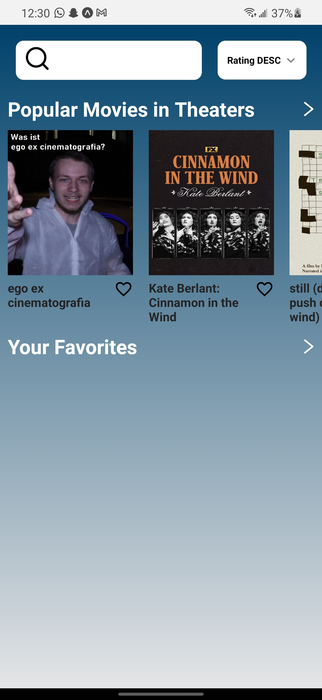
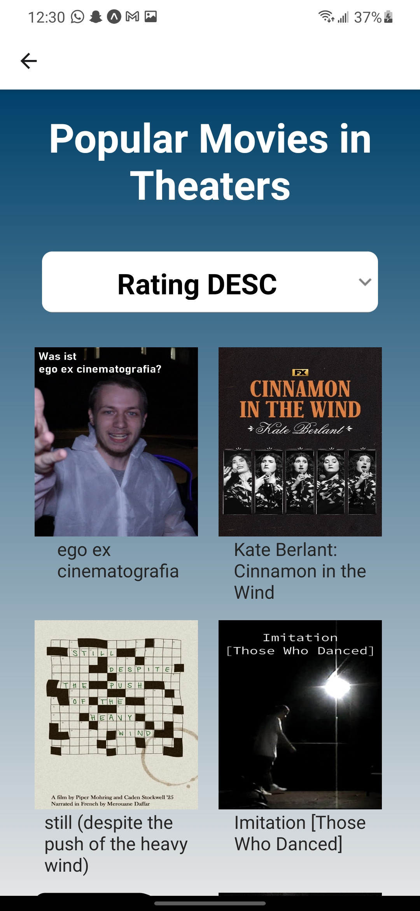

# My Movie List

## Description
My Movie List is a mobile application made with React Native and powered by TMDB's API

My Movie List offers the following features:
- Recent popular movies on theaters
- Movies searches by name
- Get a generic information about a specific movie (title, rating, synopsis, etc...)
- Add a specific movie to your favorite list

## Screenshots

Main screen | Main Screen with favorite movies
:--------:|:--------:
 | 

Search screen | Search screen with results
:-----------:|:-----------:
 | 

Movie Detail screen
:----------------:

Popular movies grid list | Favorite movies grid list
:-----------------:|:----------------------:
 | 

## Built With

- [ReactNative](https://reactnative.dev/docs/environment-setup) - A FrameWork to build mobile app
- [TMDBAPI](https://www.themoviedb.org/documentation/api?language=en) - Open-source TMDB API for movie streaming lovers
- [Expo](https://docs.expo.dev/) - A developer tool for creating projects, viewing logs, opening on your device, publishing
